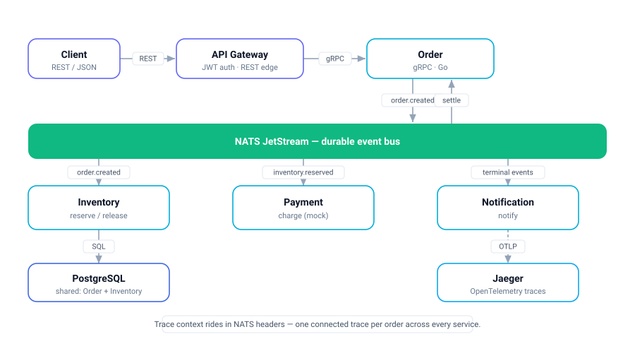
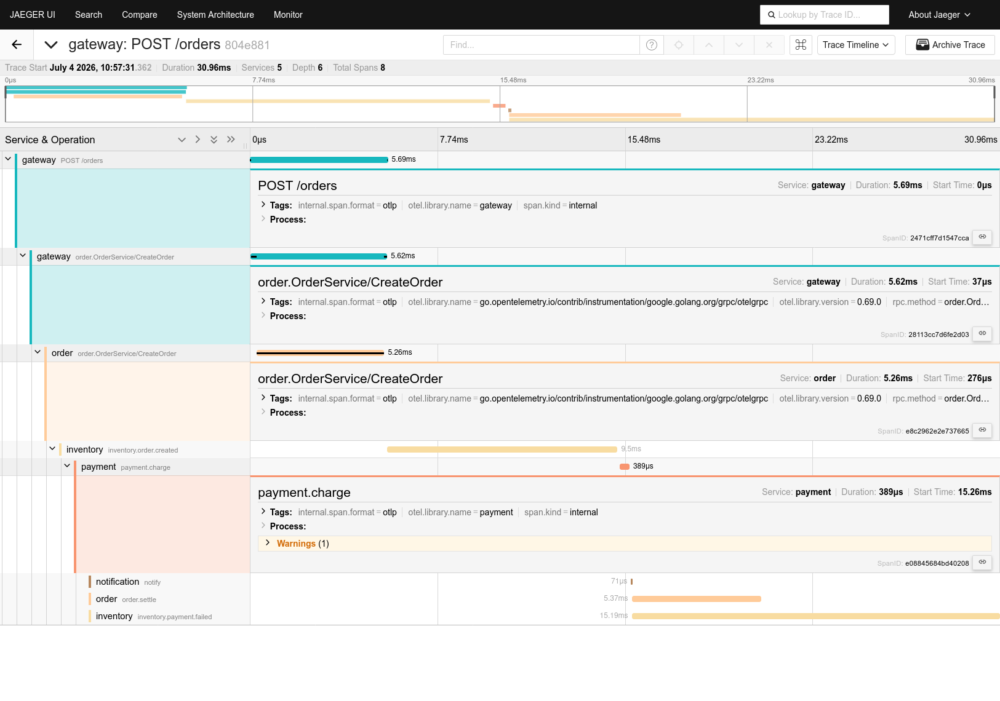

# CartFlow — Event-Driven Order System

Go microservices demonstrating a **choreography-based saga** with **compensation**
over NATS JetStream, fronted by a JWT gateway, running on Kubernetes with a Tilt
live-reload dev loop.


<p align="center"></p>

## Flow

```
client ─POST /orders─▶ gateway(JWT) ─gRPC─▶ order ─order.created─▶ inventory
                                        ▲                        │ reserve (atomic) + record
                                        │                        ▼
                                        │                  inventory.reserved ─▶ payment
                                        │                        │                  │ mock charge
                                        │        inventory.failed │        ┌─────────┴─────────┐
                                        │                         │  payment.completed   payment.failed
                                        │                         ▼        ▼                  ▼
                                        └── order status: cancelled | confirmed | cancelled
                                                                                   │
                                              inventory RELEASES stock ◀───────────┘ (compensation)
        notification logs every terminal event.
```

No orchestrator — each service reacts to events. JetStream makes events durable,
so services boot in any order and nothing is lost.

## Services

- **gateway** — JWT auth REST edge; `POST /login`, calls order over **gRPC** for `/orders`.
- **order** — **gRPC** `CreateOrder`/`GetOrder`; publishes `order.created`, settles from terminal events.
- **inventory** — reserves stock atomically, records reservations, **releases on payment failure**.
- **payment** — mock charge on `inventory.reserved`; deterministic decline at `qty >= 5`.
- **notification** — logs every terminal outcome (swap `notify()` for real email/SMS).

Seeded stock: `widget=10`, `gadget=5`. Demo credentials: `demo` / `demo`.

## Run

Terraform provisions the platform (NATS via Helm + the app Secret); Tilt builds and
runs Postgres + the services. **Terraform first** — the services mount its Secret.

```bash
minikube start
make tf-up         # terraform: NATS (Helm) + Secret with generated JWT key
make up            # tilt: builds 5 images, deploys Postgres + Jaeger + services
make demo          # asserts confirm / out-of-stock / payment-decline+compensation + 401
```

Ownership: **Terraform** = NATS + secrets · **Kustomize/Tilt** = Postgres + Jaeger + your services.
CI (`.github/workflows/ci.yml`) runs `build + vet + test` on every push.

## Tracing

Every service is instrumented with **OpenTelemetry**; trace context rides in NATS
message headers, so a single order is **one connected trace across all services**.
After `make demo`, open the Jaeger UI at **http://localhost:16686** and pick service
`gateway` → you'll see one trace per order spanning `POST /orders` (gateway) →
`CreateOrder` (order, gRPC) → `inventory.order.created` → `payment.charge` →
`order.settle`, plus `notify` — HTTP edge, gRPC call, and async NATS hops all stitched
into a single trace.

<p align="center"></p>

Manual:
```bash
TOKEN=$(curl -s -XPOST localhost:8080/login -d '{"user":"demo","pass":"demo"}' | jq -r .token)
curl -XPOST localhost:8080/orders -H "Authorization: Bearer $TOKEN" -d '{"item":"widget","qty":2}'
curl localhost:8080/orders/<id>  -H "Authorization: Bearer $TOKEN"
```

## Layout

```
services/{gateway,order,inventory,payment,notification}/main.go
proto/order.proto           # gRPC contract (generated *.pb.go committed)
internal/events/events.go   # shared subjects, payloads, JetStream setup
Dockerfile                  # one file, --build-arg SERVICE=...
internal/obs/obs.go         # OpenTelemetry setup + NATS trace propagation
deploy/k8s/                 # Postgres + Jaeger + services (kustomize)
deploy/terraform/           # NATS (Helm) + app Secret
Tiltfile · Makefile · .github/workflows/ci.yml
```

Regenerate gRPC stubs after editing the proto: `make proto`.

## Deliberate cuts

- Metrics (Prometheus/Grafana) not wired — tracing first; metrics are the next add.
- Shared Postgres DB (separate tables), not DB-per-service — comes with the AWS/RDS module.
- Postgres stays on Kustomize (single-instance dev DB doesn't need a Helm chart); no PVC.
- Jaeger is all-in-one/in-memory; AWS EKS module still deferred — this all runs on minikube.
- Payment is a mock rule; `charge()` is where a real gateway (Midtrans/Stripe) goes.
